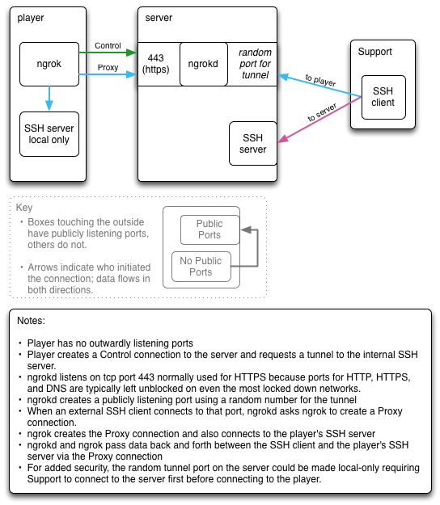
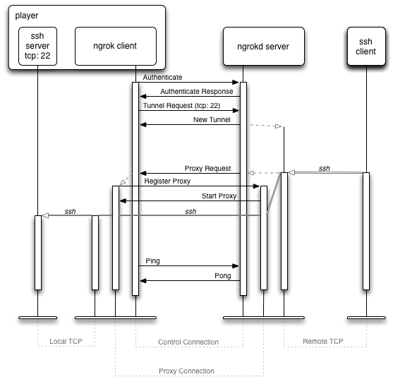

Title:  Using Ngrok for RDM  
Author: Harvey Chapman <hchapman@realdigitalmedia.com>  
Date:   May 2nd, 2016  

# [%title] #

[%author] <<hchapman@realdigitalmedia.com>>  
[%date]  

## Introduction ##

Ngrok is a tool for tunneling internet connections through NATed firewalls. RDM uses it to connect to an SSH server running locally on a player.

### Ngrok Documentation ###

Ngrok usage is fairly well documented, but the implementation, building, and deployment are not. It may be helpful to browse the official Ngrok documentation before continuing with this document.

- [README.md][]
- [docs/DEVELOPMENT.md][]
- [docs/SELFHOSTING.md][]
- [ngrok.com][]

[README.md]: https://github.com/inconshreveable/ngrok/blob/master/README.md
[docs/DEVELOPMENT.md]: https://github.com/inconshreveable/ngrok/blob/master/docs/DEVELOPMENT.md
[docs/SELFHOSTING.md]: https://github.com/inconshreveable/ngrok/blob/master/docs/SELFHOSTING.md
[ngrok.com]: https://ngrok.com/

## How It Works ##

### In Pictures ###

#### Design ####



#### Sequence ####



### In Text ###

Roughly, on start-up...

- ngrok (client) connects and sends an Auth message to ngrokd (server). This is called the Control connection.
- ngrokd replies with an AuthResp message
- ngrok sends one ReqTunnel message per desired tunnel
- ngrokd creates and returns a NewTunnel message for each
- ngrokd creates listening sockets using random port numbers for each tunnel

Later, an incoming connection to one of the listening ports triggers the following...

- ngrokd sends a ReqProxy message to ngrok over the control connection.
- ngrok creates a new connection to ngrokd and sends a RegProxy message so ngrokd will know how to link the two connections. This is called the Proxy connection.
- ngrokd sends a StartProxy message over the proxy connection.
- ngrokd immediately starts forwarding data from the incoming connection through the proxy connection.
- ngrok makes a local connection to the tunneled port and immediately begins sending data back and forth between the local connection and the proxy connection.

## How to Build ##

On OS X, install go with homebrew. To build local binaries, run `make all` or `make release-all` for debug or release versions. To build for other architectures, use this command `GOOS=linux GOARCH=amd64 make release-all`. For 32-bit machines, use `386`. Binaries are left in the bin folder. Architecture specific builds are in subdirectories named like "linux-amd64".

## How to Install/Run ##

### Server ###

Copy the correct ngrokd binary for the server architecture along with `server.sh` to the server. On the server, ensure that the following files exist:

| filename	| description	|  
| ------	| ------	|  
| ngrokd	| the server binary	|  
| server.sh	| helpful start-up script	|  
| server.key	| the server's private key	|  
| server.crt	| the servers's full-chain certificate |
| ngrok_authtokens.txt	| White space (including newlines) separated list of valid client authentication tokens. If this file doesn't exist or is empty, all connections will be refused.	|  

The server private key and certificate files as well as the `ngrok_authtokens.txt` file can be symbolic links to the real files.
Run the server with `./server.sh`. By default all logging is written to `ngrokd.log` in the current directory. The log is automatically rotated by ngrokd.

### Client ###

This topic will be covered fully in a _How to Test_ section in this document. The simplest method is the following command which connects to the server using `AUTH_TOKEN` and creates a tunnel to a local SSH (tcp port 22) server.

`./ngrok -authtoken AUTH_TOKEN -proto tcp 22`

Notice that the server name is not given because it is hardcoded into the ngrok client binary.

## How to Test ##

Ngrok is not difficult to test. Remember when testing on the server that everything runs out of a single directory. So it's possible to test a server in a test directory on a different port (from production's 443) while continuing to run the current production server.

### Debug vs Release ###

The main difference between the debug and release binaries is with SSL encryption. The debug client trusts an additional fake "Snake Oil" CA, certificate authority, while the release client only trusts ngrok.com. For RDM's use, two additional CA certificates have been added for Let's Encrypt and StartCom, two free trusted certificate authorities. Instructions for creating certificates from them are detailed in the "Creating SSL Certificates" document.

The server does not have any differences between debug and release versions. However, if you don't give the server a private key and certificate to use, it will use the fake "Snake Oil" key and certificate contained in the binary.

### Test Order ###

It's recommended to test in this order:

| Client | Server | SSL Files |  
|  ------	| ------	| ------	|  
| debug,local | debug,local | no |  
| debug,local | debug,remote | no |  
| debug,local | release,remote | yes |  
| release,local | release,remote | yes |  
| release,player | release,remote | yes |  

debug
: `make all`, `make client`

release
: `make release-all`, `make release-client`, `make release-server`

local
: the build machine

remote
: the server, tunnel.neocastnetworks.com.

- When testing, change the port from 443 to 4443 so it will not interfere with the current production ngrokd. Also, comment out the `-log=ngrokd.log` option.
- Remember to use the `GOOS=linux GOARCH=amd64` environment variables to build the server binary. `GOOS=linux GOARCH=amd64 make release-server`

SSL Files
: "No" means commenting out the `-tls*` options in server.sh.

### Client ###

There's a `client.sh` file and a `config.ml` file in the `RDM` directory already setup for testing. The default client configuration has been changed to suit RDM and has been compiled into the client.

#### client.sh ####

```
../bin/ngrok \
    -log-level=DEBUG \
    -log=stdout \
    -config=config.yml \
    "$@"
```

It's best to send the output to stdout for testing.

#### config.yml ####

```
server_addr: localhost:4443
#server_addr: 192.168.25.142:4443
#server_addr: 192.168.25.142.xip.io:4443
#server_addr: tunnel.neocastnetworks.com:4443

#server_addr: tunnel.neocastnetworks.com:443
auth_token: 0123456789abcdefghijklmnopqrstuvwxyz

tunnels:
  ssh:
    proto:
      tcp: 22
```

A YAML-formatted config[^config_file_format] file can specify everything the client needs including the server address, authentication token, and tunnel definitions. Here, the config file is setup to test via localhost, an IP address, a DNS name that resolves to the same IP address, the test port (4443) on the server, and the actual production port (443) on the server. 

Tunnels may be defined as shown in the file. The tunnel name, `ssh` above is an arbitrary name. Multiple tunnels may exist in the config file, but only one may be given on the command line.

To run with tunnels defined in the config file, use `./client.sh start ssh` or `./client.sh start-all`. 

If you only have one tunnel, you can use the command line by itself:

```
ngrok [Logging options] -authtoken 0123456789abcdefghijklmnopqrstuvwxyz \
	-proto tcp 22
```

The default server address is tunnel.neocastnetworks.com:443 and is compiled into the client.

[^config_file_format]: Some documentation of the config file is found at <https://ngrok.com/docs#upgrade-config>. Look for the "OLD config" formatting.

### Server ###

The server is easiest to run when using the provided `server.sh` shell script.

#### server.sh ####

This script makes it easier to run the server for testing and for release. By default, the server logs at a DEBUG level, uses the fake Snake Oil private key/certificate files, and listens on ":4443". It also listens for HTTP and HTTPS connections. Ngrok was written to help web developers. Since RDM doesn't need this, those are disabled with `-httpAddr=""` and `-httpsAddr=""`. The `-domain` setting is used by ngrokd when generating tunnel URLs, e.g. DOMAIN=acme.com results in tcp://acme.com:PORT.

```
if [ "$(hostname)" == "tunnel" ]; then
    DOMAIN=tunnel.neocastnetworks.com
    EXTRA_ARGS="-tunnelAddr=:443 \
                -tlsCrt=server.crt \
                -tlsKey=server.key \
                -log-level=INFO \
                -log=ngrokd.log"
    NGROKD="./ngrokd"
else
    if [ "$DOMAIN" == "" ]; then
        DOMAIN=localhost
    fi
    EXTRA_ARGS=""
    NGROKD="../bin/ngrokd"
fi

${NGROKD} \
    -httpAddr="" \
    -httpsAddr="" \
    -domain=${DOMAIN} \
    -authTokens="ngrok_authtokens.txt" \
    ${EXTRA_ARGS} \
    "$@"
```

#### ngrok_authtokens.txt ####

If provided via the command line, ngrokd will only allow connections from clients with valid authentication tokens provided from a given text file.

```
0123456789abcdefghijklmnopqrstuvwxyz
```

The file is white-space delimited including newlines, so do not put spaces inside of tokens. Also, there's no support for quoting or escapes. Putting one token per line is good format.

#### server.key ####

The private key for the server. See the "Creating SSL Certificates" document for more information.

#### server.crt ####

The full chain certificate for the server. See the "Creating SSL Certificates" document for more information.

 
